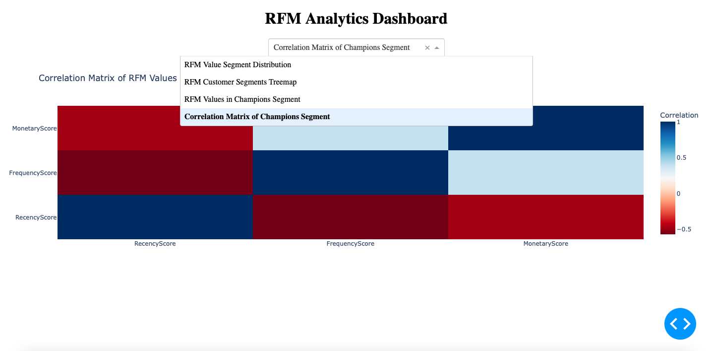

# RFM Analytics Dashboard

This GitHub repository contains a Python script that generates an interactive Dash dashboard for analyzing customer data using the RFM (Recency, Frequency, Monetary) framework.

The dashboard includes the following visualizations:

1. **RFM Value Segment Distribution**: A bar chart showing the distribution of customers across the Low-Value, Mid-Value, and High-Value segments.

2. **RFM Customer Segments Treemap**: A treemap visualization displaying the various RFM customer segments, such as Champions, Potential Loyalists, At Risk Customers, Can't Lose, and Lost.

3. **RFM Values in Champions Segment**: A box plot visualization showing the distribution of Recency, Frequency, and Monetary scores for the Champions customer segment.

4. **Correlation Matrix of Champions Segment**: A heatmap visualization displaying the correlation between the RFM values within the Champions customer segment.

## Usage

1. Clone the repository:

```bash
git clone https://github.com/your-username/rfm-analytics-dashboard.git
```

2. Navigate to the project directory:

```bash
cd rfm-analytics-dashboard
```

3. Install the required dependencies:

```bash
pip install -r requirements.txt
```

4. Run the Dash app:

```bash
python app.py
```

5. Open your web browser and navigate to `http://localhost:8050` to view the RFM Analytics Dashboard.

## Dashboard Screenshot



The dashboard screenshot shows the various visualizations available in the app, including the RFM Value Segment Distribution, RFM Customer Segments Treemap, RFM Values in Champions Segment, and the Correlation Matrix of Champions Segment.
